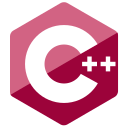
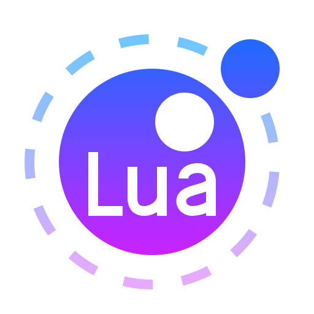

### ⭐: My Stats :

<h3 align="left">🛠 Language and tools</h3>

  

    
  <!--h4>
    Main:
  </h4>
  &nbsp;-->
  
  &nbsp;
  
  &nbsp;
  
  &nbsp;
  
  &nbsp;
  
  &nbsp;
  
  &nbsp;
  
  &nbsp;
  
  &nbsp;
  
  &nbsp;
  
  &nbsp;
  
  &nbsp;
  
  

  <!--div>
    <h4>
      Secondary:
    </h4>
  &nbsp;
  
  &nbsp;
  
  &nbsp;
  
  &nbsp;
  
  &nbsp;
  
  &nbsp;
  
  &nbsp;
  
  </div-->
  

<h3 align="left">Contact Me:</h3>

