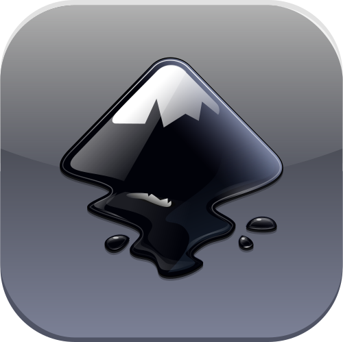

<!--div align="center">

  

</div-->

# 🌲 Adrian Chajter

**`Systems Engineer (Software Developer, Graphic Designer)`**

My main focus right now is Compilers and Tooling for **AshOS**, a complete/integrated graphical Operating System.

I split my time between **Software Engineering**, **Graphic Design**, and **Audio Engineering**.

**I choose not to develop for macOS or other Apple platforms due to their closed ecosystem control, restrictive App Store policies, and SDKs not being accesible on other platforms.**

### ⭐ My Stats :

  
  

  ### 🛠 Languages and Tools:

  

  
  
  
  
  
  
  
  
  
  
  
  
  
  
  
  
  
  
  
  
  
  
  
  
  
  
  
  
  
  
  
  
  
  
  
  
  
  <a href="https://learn.microsoft.com/en-us/windows/apps/winui/winui3/" target="_blank" rel="noreferrer"><picture><source srcset="Icons/boxes/WinUI_Box.png" height="45"></picture></a>
  <!--WinUI Vector Image Masks Do Not Load on Most Browsers, Set as Fallback-->
  
  
  <a href="https://www.stride3d.net/" target="_blank" rel="noreferrer"><picture><source srcset="Icons/boxes/Stride_Box.svg" height="45"></picture></a>
  <a href="https://godotengine.org/" target="_blank" rel="noreferrer"><picture><source srcset="Icons/boxes/Godot_Box.svg" height="45"></picture></a>
  
  
  
  
  
  
  
  
  
  
  
  

  

  ### 🖥️ Software:
  
  

    
    
    
    
    
    
    
    
    <a href="https://www.freebsd.org/" target="_blank" rel="noreferrer"><picture><source srcset="Icons/boxes/FreeBSD_Box.png" type="image/png"></picture></a>
    <!--FreeBSD Vector Image Does Not Load Properly on Most Browsers, Set as Fallback-->
    
    
    
    
    
    
    
    
  

  

<h3>📱 Contact Me</h3>

  
  &nbsp;
  

