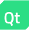
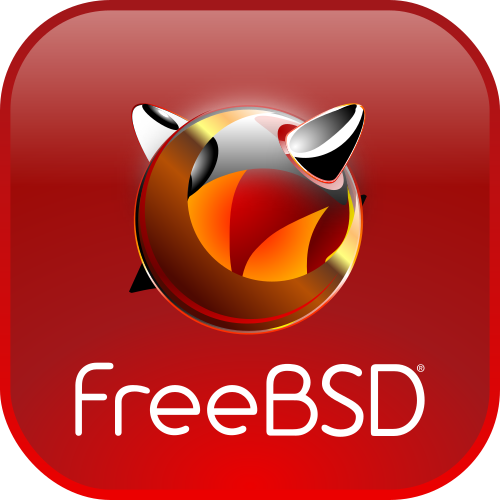

  

# 🌲 Adrian Chajter

**`Digital Craftsman (Software Developer, Graphic Designer)`**

<!--Add Text Later-->

### ⭐ My Stats :

  
  

  ### 🛠 Languages and Tools:

  

  
  
  
  
  
  
  
  
  
  
  
  
  
  
  
  
  
  
  
  
  
  
  
  
  
  
  
  
  
  
  
  
  
  
  

  

  ### 🖥️ Software:
  
  

    
    
    
    
    
    
    
    <a href="https://www.freebsd.org/" target="_blank" rel="noreferrer">
    <!--Vector Image Does Not Load Properly on Most Browsers, Set as Fallback-->
    <picture>
    <source srcset="Icons/boxes/FreeBSD_Box.png" type="image/png">
    
    </picture>
    </a>
    
    
    
    
    
    
    
    
    
  

  

  <!--div>
  
  
  </div-->
  

<h3>📱 Contact Me</h3>

  
  &nbsp;
  

